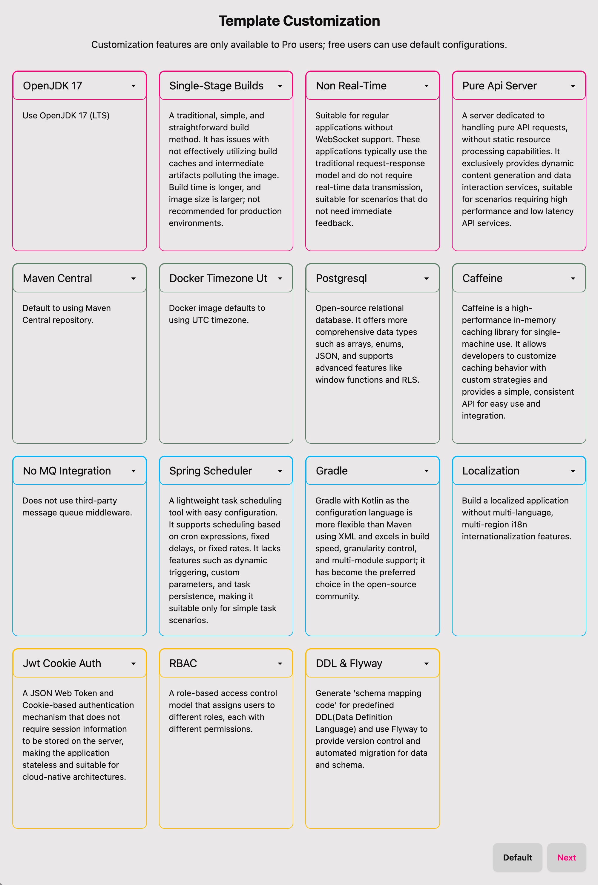

# Make Java Great Again

[](https://choosealicense.com/licenses/mit/)

[](https://www.mjga.cc)
[](https://juejin.cn/post/7410333135119253543)
[](https://qm.qq.com/q/8ojXz6ZOkE)
[](https://www.bilibili.com/video/BV1Erpje8ERF/)


🏆🎖️🥇🥈🥉🏅

- [English](README_EN.md)
- [中文](README_CN.md)

[Mjga](https://www.mjga.cc) is a newly designed, modern Java Web scaffolding built on cloud-native principles, featuring the following characteristics:

- Containerized applications
- Removable components
- Widely acclaimed unit tests

## Stack 🥝


### Containerization and Cloud-Native 🍋

1. Manage the entire lifecycle and configuration of the application through `docker-compose.yml`.
2. Customize all configurations via the `.env` file.
3. Deliver the entire application and its accompanying ecosystem components through `docker-compose.yml`.

### Out-of-the-Box 🍌

1. Integrated common basic business functions such as authentication, permission management, and cache abstraction.
2. Code Check & Format, CI/CD Plugin, Docker Integration are all ready to use out-of-the-box.
3. Comprehensive, design-driven, and environment-isolated unit tests.

### Modernization 🍒

1. Modern: Technology selection closely follows the trends of the open-source community.
2. Configurable: Supports component selection on the web interface.
3. Best Practices: Every variable and function, every module and component, are designed with best practices in mind.
4. Focus on Boundaries: Maintains its functional boundaries and does not attempt to be a "one-size-fits-all" solution.

## Component Selection 🍇

More components are under development...



## Quick Start 🍉

**Verify Environment Variables and Execution Permissions**

```shell
# confirm .env and make sure process can use it
vim ${projectRoot}/.env
# confirm gradlew executable (unix-like OS)
chmod 755 ${projectRoot}/gradlew
```
**[Install & Start Docker](https://docs.docker.com/engine/install/)**

```shell
cd ${projectRoot}
docker compose up -d database
docker compose build web
docker compose up -d web
````

**(Optional) Start on Local Machine**
```shell
# confirm .env and gradle.properties make sure process can use it
vim ${projectRoot}/.env
vim ${projectRoot}/gradle.properties
docker compose up -d database
./gradlew jooqCodegen
${projectRoot}/gradlew bootRun
```

## Common Tools 🥜

**Compile the project and generate table mapping objects and Data Access Layer based on the database schema**

```shell
# confirm .env and make sure process can use it
vim ${projectRoot}/.env
# generate schema mapping codes
./gradlew jooqCodegen
# output ->
# projectRootDir/build/generated-sources
# └── org.jooq.generated
#    └── tables # table mapping
#       ├── daos # Data Access Layer
#       ├── pojos # mapping dto
#       └── records # jooq query record

```

**Global Code Formatting**
```shell
./gradlew spotlessApply
```
**Global Code Inspection**
```shell
# confirm .env and make sure process can use it
vim ${projectRoot}/.env
./gradlew pmdMain
```

**Test**
```shell
# confirm .env and make sure process can use it
vim ${projectRoot}/.env
# will automatically generate jacocoTestReport
./gradlew test
```

[For more documentation, click here...](https://www.mjga.cc/doc/db-first)

## Test Report 🍓


## Other 🍟
1. This repository is primarily for code demonstration and issue collection. The code may lag behind the version available for download from the product's official website.
2. For product feedback, discussions, and bug reports, please submit them to the issue tracker, and I will handle them seriously.
3. I also welcome any ideas from other communities, and I will actively participate in responding.
4. More new video tutorials are being recorded, so please be patient.
5. Spread Mjga to your colleagues and friends around you, and let Java be great again.
